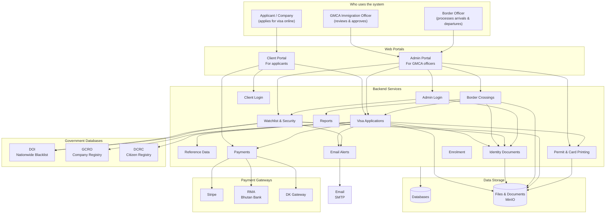
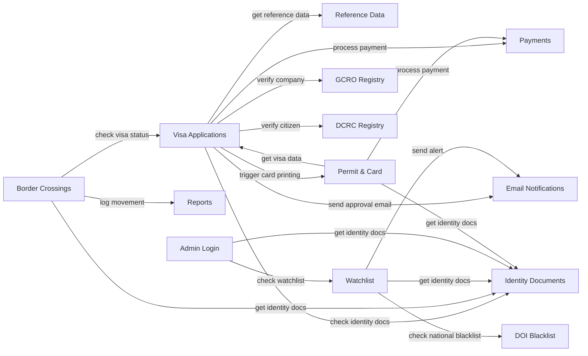
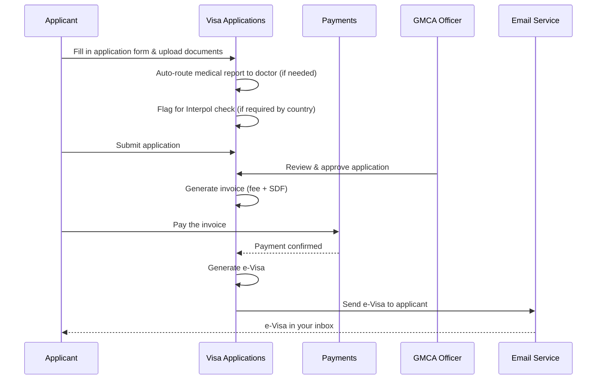
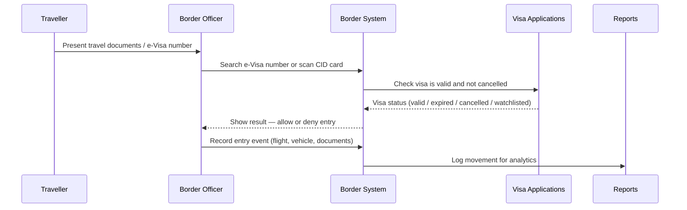
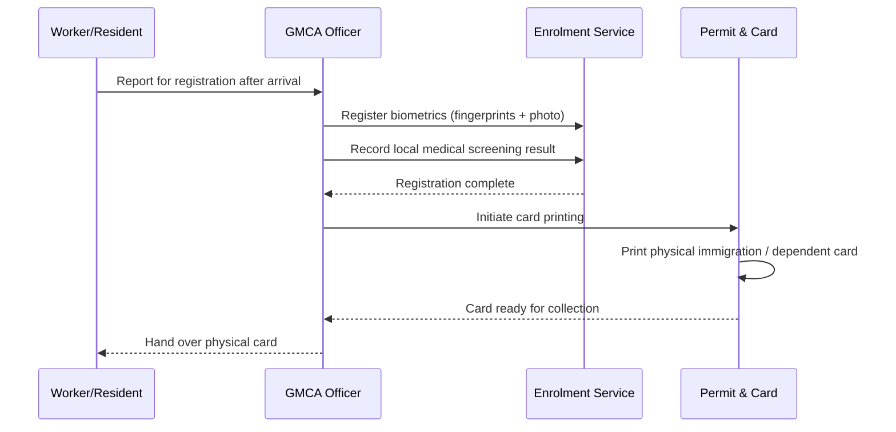
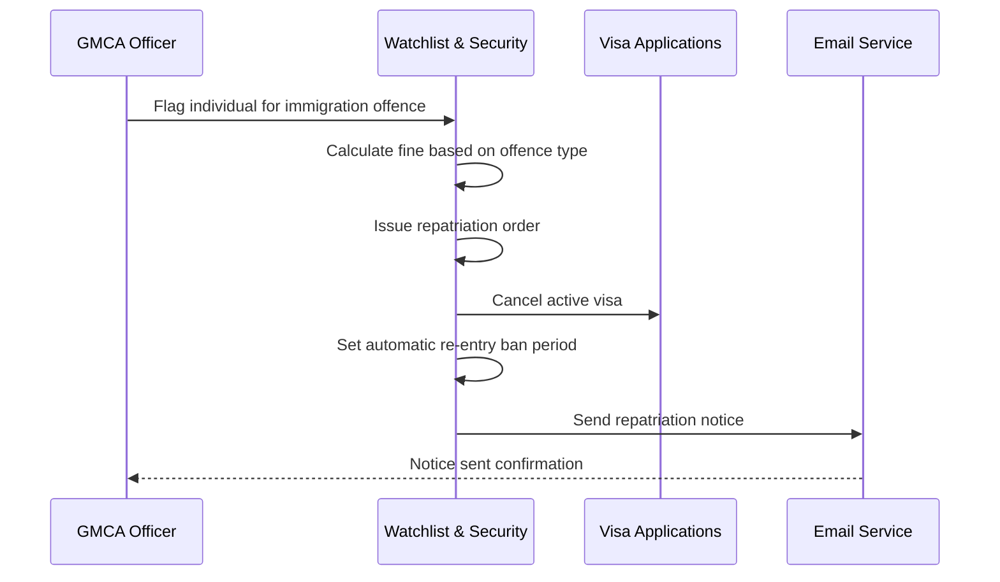
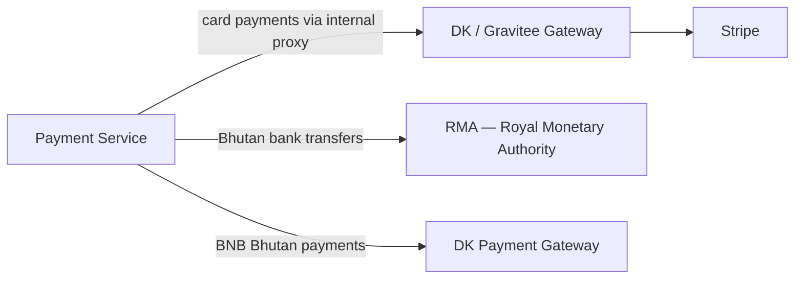

# GMCA Immigration System — System Documentation

> **System**: Gelephu Mindfulness City Authority (GMCA) — Digital Immigration Management System  
> **Built by**: ROMTech  
> **Last Updated**: May 2026

---

## What is this system?

This is the **GMCA Digital Immigration Management System** — a purpose-built platform for the Gelephu Mindfulness City Authority to manage all immigration activity in and around Gelephu Mindfulness City.

The system handles the full journey of any foreigner or resident: applying for a visa or work permit, paying fees, getting approved by GMCA immigration officers, arriving and departing at the border, and staying compliant throughout their stay. It also gives GMCA officers the tools to monitor, enforce rules, flag watchlisted individuals, and manage repatriations.

The platform is split into **12 separate backend services**. Each service is responsible for one specific area. They talk to each other internally when they need to share information.

---

## What the system does — in plain terms

### 1. Visa & Permit Applications
People and companies apply for visas and work permits online through the Client Portal. The system supports Employment Passes, Dependent Visas, Short-Term Visas, and other permit types.

Once submitted, the system automatically:
- Routes medical reports to doctors for review
- Flags applicants from certain countries for Interpol background checks
- Generates invoices for application fees and Sustainable Development Fees (SDF)
- Issues an electronic visa (e-Visa) directly to the applicant's email once approved and paid

### 2. Border Control
Immigration officers at entry points (Paro International Airport, Gelephu Border Checkpoint, etc.) use the system to process arrivals and departures.
- **Foreign visitors**: Officers search by e-Visa number to pull up all visit details
- **Bhutanese citizens**: The system scans their CID (Citizenship Identity Document) to track movement
- Long-term visitors (workers, dependents) must register their **biometrics** (fingerprints and photos) and complete a local medical screening inside the city before they are fully cleared

### 3. Physical Card Printing
After biometric registration and medical clearance, the system manages the **printing of physical immigration and dependent cards** for long-term residents.

### 4. Amendments, Cancellations & Refunds
- **Amendments**: Update travel dates, extend a visa, or update passport details
- **Cancellations**: Applicants or officers can cancel active visas or permits
- **Refunds**: Dedicated module to process refunds for valid reasons (e.g. double payments caused by system errors)

### 5. Security & Enforcement
- **Watchlists**: Flag and block individuals or companies barred from entering the city
- **Repatriation**: If someone commits an immigration offence (overstaying, mismatched ID), the system calculates fines, issues a repatriation order, and automatically bars them from re-entry for a set period

### 6. Government System Integrations
The system connects to other Bhutanese government databases to verify data:
- **DOI** (Department of Immigration) — nationwide blacklist checks
- **GCRO** (Gelephu City Registration Office) — company registry verification
- **DCRC** (Department of Civil Registration & Census) — Bhutanese citizen identity verification

---

## Table of Contents

1. [Big Picture — How it all fits together](#big-picture)
2. [The Services — What each one does](#the-services)
3. [How the Services Talk to Each Other](#how-services-communicate)
4. [Key Journeys — Step by step flows](#key-journeys)
5. [File & Document Storage](#file--document-storage)
6. [Payment Gateways](#payment-gateways)
7. [Notifications](#notifications)
8. [External Government Connections](#external-government-connections)
9. [Service Reference Table](#service-reference-table)

---

## Big Picture

The diagram below shows all the major parts of the system and who uses what.

---

## The Services

### Admin Login (`admin_auth`)
**Who uses it**: GMCA immigration officers and back-office staff.

Officers log in here to access the admin portal. The system controls what each officer is allowed to do — for example, some can only view applications while others can approve or reject them. A passkey (fingerprint or face ID) can be used instead of a password. Every action an officer takes is recorded in an audit log.

---

### Client Login (`client_auth`)
**Who uses it**: Visa applicants and companies applying for permits.

Applicants create an account here to access the client portal. Supports standard password login or passkey login. Includes password reset by email.

---

### Reference Data (`common`)
**Who uses it**: All other services internally.

This is the system's shared dictionary. It stores all the dropdown/lookup values that every other part of the system needs — things like visa types, country lists, port of entry names, document types, payment rates, FAQs, and terms & conditions. Other services ask this one when they need to display or validate those values.

---

### Visa Applications (`visa-permit`)
**Who uses it**: Applicants (to apply) and GMCA officers (to review and decide).

This is the core of the system. It manages the complete lifecycle of every visa and permit application — from the moment an applicant starts filling out a form to the moment a visa is issued or refused.

**The stages an application goes through:**
1. Applicant fills in personal details, employment, education, and dependents
2. Applicant uploads supporting documents (passport, photos, medical reports)
3. System automatically routes medical reports for doctor review if required
4. System flags applications from certain countries for Interpol checks
5. Application is submitted and moves to GMCA officers for review
6. Officer approves or rejects the application
7. System generates an invoice (application fee + Sustainable Development Fee)
8. Applicant pays — system confirms payment
9. e-Visa is generated and emailed directly to the applicant

Also handles: visa extensions, amendments (e.g. new passport, changed travel dates), cancellations, escalations to senior officers, and refunds.

---

### Permit & Card Printing (`permit-service`)
**Who uses it**: GMCA officers after a visa is approved and the person has arrived.

Once a long-term visitor (worker, dependent) has arrived, registered their biometrics, and cleared local medical screening, this service manages the **printing of their physical immigration card or dependent card**. It handles the permit record, card issuance workflow, and any related payments.

---

### Payments (`payment`)
**Who uses it**: Applicants when paying fees; system internally when confirming payments.

Processes all fee payments. Supports three payment methods:
- **Stripe** — for international card payments (routed via the internal DK/Gravitee gateway)
- **RMA** — Royal Monetary Authority of Bhutan (local bank transfers)
- **DK Payment Gateway** — BNB Bhutan payment system

Tracks every transaction and logs exchange rates for multi-currency payments.

> The Stripe test environment is only available Monday–Friday, 9am–5pm Bhutan Time.

---

### Identity Documents / PII (`personal_identifiable_information`)
**Who uses it**: Other services internally — never directly by applicants.

Securely stores all sensitive personal identity documents:
- Passports
- Aadhaar cards & voter cards
- Birth certificates
- Other identity documents
- Contact addresses

All files are stored in MinIO (not in the database). Other services — like visa applications or border management — fetch identity data from here when they need it. Applicants cannot access this service directly from the public portal.

---

### Email Notifications (`notification_service`)
**Who uses it**: Applicants receive emails triggered by this service.

Sends automated emails when key events happen:
- Visa approved or rejected
- Visa amendment processed
- Escalation updates

Email only — no SMS or push notifications.

---

### Border Crossings (`border-management`)
**Who uses it**: Border officers at Paro Airport, Gelephu Border Checkpoint, and other entry/exit points.

When a traveller arrives or departs, the border officer uses this to:
- **Foreign visitors**: Search by e-Visa number to view all their visit details and confirm the visa is valid
- **Bhutanese citizens**: Scan their CID card to record movement in and out of the city
- Record the full crossing event (documents presented, flight or vehicle used)
- Track casual visitors
- Push all crossing data to the Reporting service for analytics

---

### Watchlist & Security (`inspection-monitoring`)
**Who uses it**: GMCA security officers.

Manages the watchlist of individuals and companies barred from entering or flagged for monitoring. Officers can add people or companies, set automatic expiry dates, and receive alerts when a watchlisted person is detected at the border.

Also tracks **movement frequency** — how often a particular person has crossed the border — which can trigger a review.

Checks against the **DOI (Department of Immigration) national blacklist** to ensure the GMCA watchlist stays in sync with nationwide bans.

---

### Reports (`reporting`)
**Who uses it**: GMCA management and officers needing analytics.

Aggregates movement and crossing data from the Border Management service. Currently provides movement frequency reports. This service is fed data automatically — it does not need manual input.

---

### Enrolment (`enrolment_service`)
**Who uses it**: Officers managing the onboarding of new long-term residents.

Handles the in-city enrolment workflow for workers and long-term visitors after they arrive — biometric registration and local medical screening. This service is currently under active development.

---

## How Services Communicate

The services don't talk to each other over the public internet. They use a private internal messaging channel (TCP). Think of it as an internal phone line between departments — fast, direct, and not visible to the outside world.

---

## Key Journeys

### Applying for a Visa or Work Permit

---

### Arriving at the Border

---

### In-City Registration (for workers & long-term residents)

---

### Repatriation (Immigration Offence)

---

## File & Document Storage

All uploaded files — passport scans, photos, medical reports, supporting documents — are stored in **MinIO**, a private self-hosted file storage system. Files are never stored directly inside the database; only a reference link to the file is saved there.

| What is stored | Which service stores it |
|---|---|
| Visa application documents & photos | Visa Applications |
| Passport scans, ID documents | Identity Documents (PII) |
| Border crossing documents | Border Crossings |
| Watchlist evidence files | Watchlist & Security |
| Permit and card records | Permit & Card Printing |

All stored in a single MinIO bucket: **`gmc-visa`**

---

## Payment Gateways

| Gateway | Used for | Notes |
|---|---|---|
| **Stripe** | International card payments | Not connected directly — routed via the internal Gravitee API gateway |
| **RMA** (Royal Monetary Authority) | Bhutanese bank transfers | Uses a digital certificate to sign requests |
| **DK Payment Gateway** | BNB Bhutan local payments | API key + login credentials |

---

## Notifications

All automated messages go out by **email** only.

| When | Who gets the email |
|---|---|
| Visa approved | Applicant |
| Visa rejected | Applicant |
| e-Visa issued | Applicant (e-Visa attached) |
| Amendment processed | Applicant |
| Escalation update | Applicant |
| Repatriation order | Officer + Applicant |
| Password reset | Admin or Applicant (from their own login service) |

No SMS or push notifications are used.

---

## External Government Connections

The GMCA system connects to three Bhutanese government databases to verify data in real time:

| System | What it does | Used by |
|---|---|---|
| **DOI** — Department of Immigration | Checks if an individual is on the nationwide blacklist | Watchlist & Security |
| **GCRO** — Gelephu City Registration Office | Verifies that a company applying for a work permit is a registered business | Visa Applications |
| **DCRC** — Department of Civil Registration & Census | Confirms the identity of Bhutanese citizens (used when scanning CID at the border) | Visa Applications, Border Crossings |

---

## Service Reference Table

Quick lookup for every backend service.

| Service | What it does | Web Port | Internal Port | Database |
|---|---|---|---|---|
| `admin_auth` | GMCA officer login & roles | 5001 | 8081 | `admin_auth_service` |
| `common` | Shared reference / lookup data | 5002 | 8082 | `common_service` |
| `client_auth` | Applicant login | 5003 | 8083 | `client_auth_service` |
| `visa-permit` | Visa & permit application lifecycle | 5004 | 8084 | `visa_permit_service` |
| `notification_service` | Send emails | 5005 | 8085 | `notification_service` |
| `personal_identifiable_information` | Store identity documents | 5006 | 8086 | `personal_identifiable_information` |
| `payment` | Process payments | 5007 | 8087 | `payment` |
| `border-management` | Border entry & exit records | 5008 | 8088 | `border_management_service` |
| `inspection-monitoring` | Watchlist & repatriation | 5009 | 8089 | `inspection_monitoring_service` |
| `reporting` | Movement analytics | 5010 | 8010 | `reporting_service` |
| `enrolment_service` | Biometric & medical enrolment (WIP) | 5005 | 8085 | `enrolment_service` |
| `permit-service` | Permit & physical card issuance | 5011 | 8091 | `permit_service` |

> **Web Port** = the port the service's API listens on  
> **Internal Port** = the port other services use to talk to it directly  
> Each service has its own isolated database — no two services share a database.

---

*End of document.*
